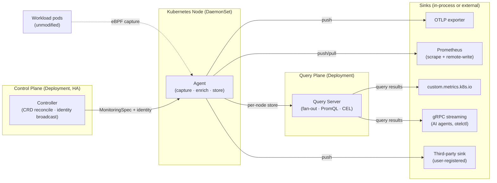
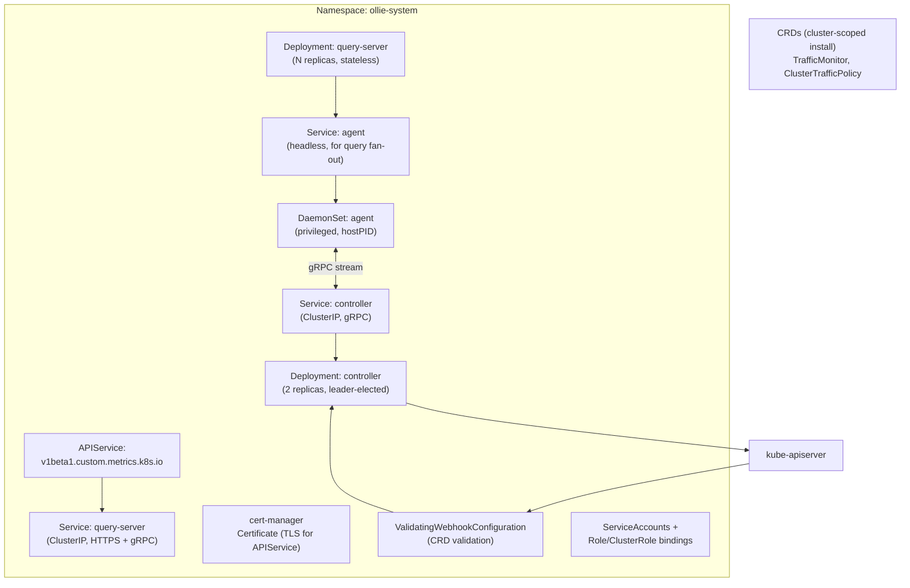

# Architecture Overview

**Status:** Draft, 2026-05-17
**Owners:** TBD

This document is the entry point into the technical design. It describes what the system is, what its pieces are, how data flows through them, and how it deploys into a cluster. Detailed designs live in their own documents linked from here; canonical decisions live in [`decisions.md`](decisions.md).

## 1. What we are building

A transparent, eBPF-based network observability framework for Kubernetes workloads. The system captures L4 and L7 traffic without modifying workloads, attaches Kubernetes identity to every record, stores recent data in-cluster for low-latency queries (HPA, AI agents), and exports to pluggable long-term sinks. It is delivered as both a deployable controller and an importable Go library so that third parties can wrap it and register their own sinks.

The product framing is "a more flexible Pixie": pluggable sinks is the headline differentiator. See [`docs/requirements.md`](../requirements.md) for the full requirement set.

## 2. Components

Four runtime components plus the library surface. All are written in Go and deployed into a single namespace (`ollie-system` by default).



**Agent (DaemonSet pod, one per node — two containers).** The pod runs **OBI** as a sibling container (privileged: `CAP_BPF`/`hostPID`/host mounts) doing the eBPF capture and emitting OTLP to localhost, and **our agent** container (unprivileged) as an OTLP receiver that enriches each event with K8s identity, writes to the local in-memory store (Prometheus tsdb HEAD + ring buffer per [`storage-and-query.md`](storage-and-query.md)), and invokes any registered push sinks. The agent also writes OBI's discovery config (mounted as a shared volume) when `MonitoringSpec` changes. Detail in [`obi-integration.md`](obi-integration.md) (sibling-container shape per [ADR-0018](decisions.md#adr-0018-obi-as-sibling-container-not-embedded-library)). The agent maintains a long-lived bidirectional gRPC stream to the controller for `MonitoringSpec` and identity-cache updates.

**Controller (Deployment, leader-elected).** Watches `TrafficMonitor` and `ClusterTrafficPolicy` CRDs. Watches Pods, Services, EndpointSlices (the canonical K8s informer per [ADR-0009](decisions.md#adr-0009-informer-custody--hybrid)). Computes per-node `MonitoringSpec` and pushes to agents over gRPC. Runs the validating admission webhook for the CRDs. Detail in [`control-plane.md`](control-plane.md).

**Query Server (Deployment).** Stateless. Fans queries out to all registered agents in parallel, aggregates results, and serves them via three surfaces: HTTP/PromQL for general use, the `custom.metrics.k8s.io` APIService for HPA, and a gRPC streaming endpoint for AI agents and CLIs. Detail in [`storage-and-query.md`](storage-and-query.md).

**Egress (per [ADR-0024](decisions.md#adr-0024-extensibility-via-wire-protocols-not-a-go-library-resolves-157)).** Data leaves over standard wire protocols, not in-process Go interfaces: OTLP gRPC + HTTP push to operator-configured endpoints, Prometheus scrape (+ remote-write), the PromQL HTTP API and custom-metrics APIService on the query server, and CEL-filtered gRPC streaming. "Adding a sink" means pointing the system at your endpoint or subscribing. Detail in [`sinks-and-extensibility.md`](sinks-and-extensibility.md).

**Public Go surface (`pkg/*`).** Deliberately small (per ADR-0024): `pkg/schema` (canonical label keys), `pkg/capture` (OBI bridge + OTLP translators), `pkg/controller` (CRD types + generated stubs). All Experimental. Detail in [`public-api.md`](public-api.md).

## 3. Data flow

A request crosses a network boundary in the cluster. Here is its full life as a record in our system:

```mermaid
sequenceDiagram
    autonumber
    participant Workload as Workload pod
    participant Kernel as Linux kernel
    participant Agent as Agent (node-local)
    participant Ctrl as Controller
    participant Store as Local store (tsdb + ring buf)
    participant QSrv as Query Server
    participant HPA as HPA / consumer

    Note over Ctrl: User created TrafficMonitor;<br/>controller resolves selector → PIDs
    Ctrl->>Agent: MonitoringSpec(allow PIDs [123, 456], protocols [HTTP, gRPC])
    Agent->>Agent: capture.AllowPID(123, 456); enable HTTP+gRPC tracers

    Workload->>Kernel: HTTP request (TCP write)
    Kernel-->>Agent: eBPF event (OBI tracer)
    Agent->>Agent: enrich (k8s.pod.* from PID cache;<br/>peer.k8s.* from controller identity broadcast)
    Agent->>Agent: cardinality (template path,<br/>apply sample rate)
    Agent->>Store: write metric (tsdb) + span (ring buf)
    Agent--)Sinks: push to registered PushSinks

    HPA->>QSrv: GET /apis/custom.metrics.k8s.io/.../qps
    QSrv->>Agent: fan-out PromQL query
    Agent->>Store: tsdb query
    Store-->>Agent: scalar result
    Agent-->>QSrv: per-node result
    QSrv-->>HPA: aggregated MetricValue
```

The hot path is short: eBPF event → enrichment → store + push, all in the agent, all in memory. Query path is fan-out + aggregate; nothing in the query path writes back to nodes.

## 4. Deployment topology



Key facts:

- **Namespace:** `ollie-system` (configurable). Same namespace for all four components.
- **CRDs:** cluster-scoped install, not namespace-scoped.
- **TLS:** cert-manager issues certificates for the query server's HTTPS surface (required by `APIService`) and for the validating webhook.
- **RBAC:** least-privilege per component. Agent reads Pods/Nodes/Kubelet; controller reads/writes CRDs + reads Pods/Services/EndpointSlices; query server reads nothing from the K8s API. Detail in [`operations.md`](operations.md).
- **Privileges, by container:** the `obi` sibling container holds `CAP_BPF` + `CAP_PERFMON` + `CAP_NET_ADMIN` + `hostPID: true` + host mounts (`/sys/fs/bpf`, `/proc`, `/sys/kernel/debug`). The `agent` container is **unprivileged**, drops all capabilities, runs as `runAsNonRoot: true`. **Neither needs `CAP_SYS_ADMIN`.** See [`operations.md`](operations.md) for the threat model.

## 5. Tech stack

| Layer | Choice | Rationale |
|---|---|---|
| eBPF data plane | OBI as sibling container ([ADR-0001](decisions.md#adr-0001-ebpf-data-plane--opentelemetry-ebpf-instrumentation-obi), [ADR-0018](decisions.md#adr-0018-obi-as-sibling-container-not-embedded-library)) | OTLP-native wire to agent; OBI is the privileged process; image-tag version pinning |
| In-cluster store | `github.com/prometheus/prometheus/tsdb` ([ADR-0002](decisions.md#adr-0002-in-cluster-store--prometheus-tsdb-head-block--parallel-ring-buffer)) | HEAD block + WAL embeddable; Thanos-validated |
| K8s client | `k8s.io/client-go` (informer + lease/leaderelection) | Standard |
| CRDs | kubebuilder markers + `sigs.k8s.io/controller-runtime` | Standard |
| Query languages | PromQL (metrics) + CEL (spans/edges) ([ADR-0008](decisions.md#adr-0008-query-language)) | Off-the-shelf libraries; right tool per data type |
| gRPC | `google.golang.org/grpc` + `protoc-gen-go` via `ap generate` | Repo convention |
| Logging/tracing | OTel SDK; `obs` package idiom from existing repo | Repo convention |
| Container base | `gcr.io/distroless/static`, CGO_ENABLED=0 | Repo convention |
| License | Apache 2.0 ([ADR-0007](decisions.md#adr-0007-license--apache-20)) | Requirement |
| Kernel/distro | COS 125+, kernel 6.x, BTF/CO-RE ([ADR-0006](decisions.md#adr-0006-kerneldistro-target--cos-125-kernel-6x-btfco-re-required)) | Requirement |

## 6. Failure modes (overview)

| Failure | Effect | Mitigation |
|---|---|---|
| Agent pod crashes | That node's recent data lost (10 min retention) | DaemonSet restarts; WAL replay restores in-flight HEAD ([ADR-0012](decisions.md#adr-0012-tsdb-block-duration-and-wal-strategy)) |
| Controller pod crashes | New CRD changes don't propagate; existing monitoring continues | Leader election; agent local fallback informer activates after 3 missed heartbeats ([ADR-0009](decisions.md#adr-0009-informer-custody--hybrid)) |
| Query server pod crashes | Queries fail until restart | Stateless + N replicas; HPA may briefly see no metric (treated as "no scale signal," not as zero) |
| OBI panic | Capture stops on that node | Adapter recovers panics, marks tracer dead, reports to controller; agent stays up for the rest of its surface |
| Sink slow / down | Backpressure into the agent | `PushSink` returns `ErrDropped`; core records counter, continues. A bad sink cannot tear the agent down |
| K8s API server unreachable | Identity resolution stale | Cache is the source of truth; informers reconnect with backoff |
| Kubelet unreachable | Local PID→pod mapping stale | Cache; new pods get unattributed flow records until Kubelet returns |
| Disk full (WAL) | Capture continues; WAL writes drop | Volume sized for 2× retention; alarmed by self-observability metric |
| TLS uprobe attach fails | TLS captures missing for that library/binary | Logged; non-TLS captures continue; controller surface flags |

Detail per component in their respective design docs. The whole-system observability story (how we *see* these failures) lives in [`operations.md`](operations.md).

## 7. Requirements traceability

This table maps every section of [`docs/requirements.md`](../requirements.md) to the design doc(s) that satisfy it.

| Requirement | Design doc(s) |
|---|---|
| §2.1 Capture | [`data-plane.md`](data-plane.md), [`obi-integration.md`](obi-integration.md) |
| §2.1 Topology metadata | [`topology.md`](topology.md), [`data-plane.md`](data-plane.md) |
| §2.2 Control plane (CRD) | [`control-plane.md`](control-plane.md) |
| §2.3 Storage and query | [`storage-and-query.md`](storage-and-query.md) |
| §2.4 Sinks (library + controller) | [`sinks-and-extensibility.md`](sinks-and-extensibility.md), [`public-api.md`](public-api.md) |
| §2.5 Standard derived metrics | [`storage-and-query.md`](storage-and-query.md) (PromQL examples), [`data-plane.md`](data-plane.md) (schema) |
| §2.6 Cardinality control | [`control-plane.md`](control-plane.md) (knobs), [`data-plane.md`](data-plane.md) (enforcement), [`storage-and-query.md`](storage-and-query.md) (aggregation) |
| §2.7 UI considerations | API shape in [`storage-and-query.md`](storage-and-query.md); roadmap in [`roadmap.md`](roadmap.md) |
| §3 Operational requirements | [`operations.md`](operations.md) |
| §3 Kernel / distro target | [ADR-0006](decisions.md#adr-0006-kerneldistro-target--cos-125-kernel-6x-btfco-re-required), [`testing-and-benchmarks.md`](testing-and-benchmarks.md) |
| §3 License | [ADR-0007](decisions.md#adr-0007-license--apache-20) |
| §4 Consumers | [`sinks-and-extensibility.md`](sinks-and-extensibility.md), [`storage-and-query.md`](storage-and-query.md) |
| §5 Non-goals | (out of scope by construction) |
| §6 Decisions | [`decisions.md`](decisions.md) — ADR 0001–0007 carried forward; 0008–0013 added during design |
| §7 Still open | resolved in [`decisions.md`](decisions.md) ADRs 0008–0013; new opens (if any) tracked per design doc |

## 8. What's intentionally not here

This document is a map, not a manual. For any of these, see the linked doc:

- CRD schemas → [`control-plane.md`](control-plane.md)
- Sink interface shapes → [`sinks-and-extensibility.md`](sinks-and-extensibility.md)
- The exact eBPF programs and how OBI is adapted → [`obi-integration.md`](obi-integration.md)
- Storage internals, query semantics, schema reference → [`storage-and-query.md`](storage-and-query.md)
- Embedder's wiring story → [`public-api.md`](public-api.md)
- Test/benchmark methodology → [`testing-and-benchmarks.md`](testing-and-benchmarks.md)
- Security model and day-2 ops → [`operations.md`](operations.md)
- Deferred features and roadmap → [`roadmap.md`](roadmap.md)

## Open questions

None at this level. Open questions on specific subsystems are documented in their respective design docs.
