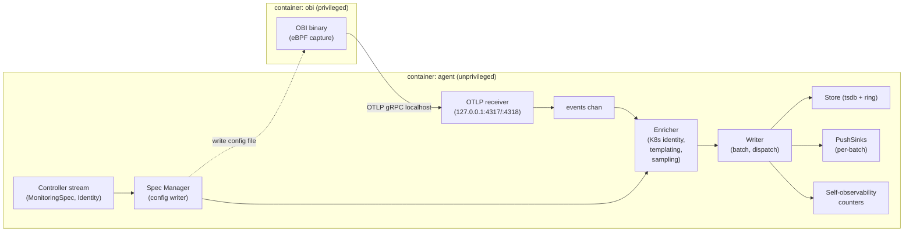
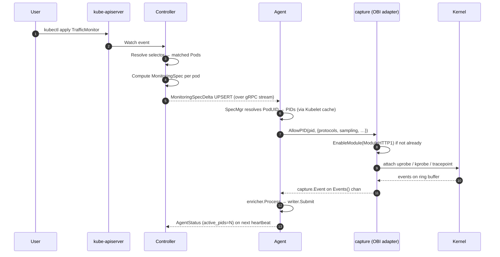

# Data Plane (Agent)

**Status:** Draft, 2026-05-17 — **partially superseded.** [ADR-0021](decisions.md#adr-0021-lean-v03--agent-re-uses-obis-native-enrichment) removed the enricher/PID-cache/identity-client narrative (OBI's native K8s enrichment is ON; the agent attaches nothing). [ADR-0024](decisions.md#adr-0024-extensibility-via-wire-protocols-not-a-go-library-resolves-157) removed the in-process sink registry and the `obsapi` library configuration story (§8's `obsapi.Config`, open question 3). The DaemonSet/OBI topology, reload, and self-obs content remains current; read [`obi-integration.md`](obi-integration.md) and [`sinks-and-extensibility.md`](sinks-and-extensibility.md) first.
**Owners:** TBD

This document specifies the per-node agent: the DaemonSet pod that runs eBPF capture, enriches each event with Kubernetes identity, writes to the local in-cluster store, and feeds registered sinks. It satisfies requirements §2.1 (Capture) and §2.5 (Standard derived metrics) and implements [ADR-0006](decisions.md#adr-0006-kerneldistro-target--cos-125-kernel-6x-btfco-re-required).

The agent's job is **deterministic and tight**: events come out of OBI, they get enriched, they get written. Everything else (CRD watching, identity broadcasting, cross-node aggregation) is the controller's or query server's job.

## 1. Process structure

Per [ADR-0018](decisions.md#adr-0018-obi-as-sibling-container-not-embedded-library), the agent runs as **one of two containers** in the DaemonSet pod. OBI runs in the sibling container, owns all kernel privileges, and emits OTLP to localhost. The agent container is unprivileged and looks like an OTLP receiver + storage + sink dispatcher.



The hot path is **OBI (capture, OTLP emit) → loopback → OTLP receiver → enricher → writer**. The OTLP hop is local (loopback, no network), happens in batches per OBI's emit cadence (not per event), and runs in a small number of goroutines on the agent side.

The control path (`Controller stream → Spec Manager → OBI config file → OBI reload`) is asynchronous and bursty. Spec Manager debounces reloads over a 500 ms window to avoid thrashing OBI during workload rollouts. The control path never gates the hot path.

## 2. Subsystems

### 2.1 Capture (`pkg/capture`)

The OBI-bridge package. Hides the sibling-container details behind the `Manager` interface. Details in [`obi-integration.md`](obi-integration.md). The agent uses it via:

```go
mgr, err := capture.New(capture.Config{
    Logger:      log,
    ObiConfigPath: "/etc/ollie/obi-config/config.yaml",  // shared volume
    OTLPGRPCAddr:  "127.0.0.1:4317",
    OTLPHTTPAddr:  "127.0.0.1:4318",
})
if err != nil { /* fatal */ }
mgr.EnableModule(capture.ModuleL4TCP, capture.ModuleConfig{})
// HTTP/gRPC/TLS modules enabled when first MonitoringSpec requires them.
// Each EnableModule call updates the OBI config file and signals reload.

go func() {
    for ev := range mgr.Events() {
        // Events arrive from the OTLP receiver, translated to capture.Event
        enricher.Process(ev)
    }
}()
```

### 2.2 Spec Manager (`internal/specmgr`)

Receives `MonitoringSpecDelta` messages from the controller stream ([`control-plane.md`](control-plane.md) §4) and translates them into capture and enricher state.

Responsibilities:
- Resolve `spec.PodUID` → local PIDs (via the Kubelet `/pods` cache + `/proc/<pid>/cgroup`); see [`topology.md`](topology.md).
- For each resolved PID, call `capture.AllowPID(pid, …)` with the spec's protocol set. The Manager rewrites OBI's discovery config and signals reload (per [`obi-integration.md`](obi-integration.md) §5).
- For each pod no longer covered, call `capture.BlockPID(pid)`.
- Compile cardinality knobs (templating regexes, sampling rates) and hand the compiled forms to the enricher.
- Maintain a `pod_uid → MonitoringSpec` map for the enricher to consult on each event.

Idempotent. Re-application of the same spec is a no-op (Generation-gated). Rapid changes are debounced before reaching OBI's config writer to avoid reload thrash.

### 2.3 Enricher (`internal/enricher`)

Per-event enrichment. Single function on the hot path:

```go
type Enricher struct {
    pidIndex      *pidcache.Cache         // PID → Pod identity (topology pkg)
    peerResolver  *topology.PeerResolver  // IP → Identity
    specsByPodUID map[types.UID]*MonitoringSpec
    rules         atomic.Pointer[ruleSet] // compiled templating + sampling
    hooks         []capture.Enricher      // user-registered hooks
    metrics       *enricherMetrics
}

func (e *Enricher) Process(ev capture.Event) {
    src := e.pidIndex.LookupByPID(ev.PID)
    spec, ok := e.specsByPodUID[src.PodUID]
    if !ok {
        e.metrics.UnmatchedDrop.Inc()
        return
    }

    // 1. Source identity (k8s.*)
    applyIdentity(&ev, src)

    // 2. Peer identity (peer.k8s.* / peer_external)
    if peer := e.peerResolver.Lookup(ev.PeerIP); peer != nil {
        applyPeerIdentity(&ev, peer)
    } else {
        ev.Attrs["peer_external"] = "true"
        ev.Attrs["peer_ip"] = ev.PeerIP.String()  // bounded by spec.cardinality
    }

    // 3. Templating
    if r := e.rules.Load(); r != nil {
        r.ApplyTemplating(&ev, spec)
    }

    // 4. Sampling
    if !r.SampleDecision(&ev, spec) {
        e.metrics.SamplingDrop.Inc()
        return
    }

    // 5. User hooks
    for _, h := range e.hooks {
        h(ctx, &ev)
    }

    // 6. Hand to writer.
    writer.Submit(ev)
}
```

The whole function is allocation-bounded (one `Event` per call, attributes are a small map with capacity hints). Profiling targets per call: ≤500 ns at 10k events/s/agent steady state.

### 2.4 Writer (`internal/writer`)

Batches events by destination and dispatches to the store and push sinks. Architecturally simple:

```go
type Writer struct {
    store      *store.Store
    sinks      *sink.Registry
    batchTicker *time.Ticker  // default 1s
    batch       batchBuf
    mu          sync.Mutex
    metrics    *writerMetrics
}

func (w *Writer) Submit(ev capture.Event) {
    w.mu.Lock()
    w.batch.add(ev)
    w.mu.Unlock()
}

// On tick (or on batch full):
//   1. swap batch out, unlock
//   2. write metrics to tsdb (via store.Appender — batch-fsynced WAL)
//   3. write spans/edges to ring buffers
//   4. construct a sink.Batch and dispatch to every PushSink in parallel
//      (per-sink bounded buffer; see sinks-and-extensibility.md §4)
```

Sink dispatch happens in dedicated goroutines per sink so a slow sink doesn't gate others.

### 2.5 Topology client (`pkg/topology`)

Maintains two caches:
- **Local PID cache.** Built from Kubelet `/pods` + `/proc/<pid>/cgroup`. Watched for K8s pod-update events (via the controller stream's identity broadcast, scoped to this node).
- **Peer identity cache.** Populated by `IdentitySnapshot` and `IdentityDelta` messages from the controller. Has a local fallback informer activated per [ADR-0009](decisions.md#adr-0009-informer-custody--hybrid).

Details in [`topology.md`](topology.md).

### 2.6 Self-observability surface

Every component on this list exposes its own Prometheus metrics; the agent runs a `/metrics` listener on `:9090` (separate from the OTLP receive port). Names prefixed `ollie_agent_*`. The full list is in [`operations.md`](operations.md) §6.

Tracing: the agent uses the `obs` package idiom from the existing repo (`ctx, span := obs.Start(ctx, "name", obs.String(...))`). All major operations (spec apply, enrichment, batch write, sink dispatch) are spans; spans are sampled (default 1%) and exported via OTLP to a configurable collector.

## 3. Per-pod config flow

End-to-end: user creates `TrafficMonitor` → enabled module set reaches the kernel.



Latency target: end-to-end CR-create → first event captured ≤ 5 seconds in a healthy cluster.

## 4. Protocol coverage matrix

Per [`obi-integration.md`](obi-integration.md) §5, the agent exposes the OBI-supported modules. Coverage for v1 release:

| Capability | v1 release | Source |
|---|---|---|
| L4 TCP bytes/conns/rtt/retransmits | ✅ | OBI L4 |
| L4 timing signals (time-to-first-byte) as latency proxy | ✅ | OBI L4 |
| HTTP/1.1 requests + latencies | ✅ | OBI HTTP (`protocols.http`) |
| HTTP/2 (h2c) requests + latencies | ✅ ¹ | OBI HTTP (`protocols.http`) |
| gRPC requests + latencies + status codes | ✅ ² | OBI gRPC (`protocols.grpc`) |
| A2A (captured as HTTP) | ✅ | OBI HTTP; semantic layer roadmap |
| TLS — Go `crypto/tls` | ✅ ³ | OBI uprobes (automatic) |
| TLS — OpenSSL | ✅ ³ | OBI uprobes (automatic) |
| TLS — BoringSSL | ⚠️ limited ³ | OBI partial (static-linked ⇒ no `libssl.so` to probe) |
| TLS — rustls, NSS, Java JSSE | ❌ roadmap | See [`roadmap.md`](roadmap.md) |
| Kafka | ❌ roadmap | OBI pending |
| SQL (PostgreSQL/MySQL/MongoDB/Redis) | optional | OBI; not default-enabled in `ClusterTrafficPolicy` |
| GenAI (OpenAI/Anthropic/Gemini) | ✅ | OBI; enables "AI agents calling AI agents" observability |

Notes (see [ADR-0031](decisions.md#adr-0031-v06-phase-3-protocol-support-grpc-http2-tls) for detail):

1. **HTTP/2 is captured but not distinguished from HTTP/1.1.** OBI v0.10.0 emits no HTTP protocol-version label (`network.protocol.version` is not attached to HTTP telemetry), so cleartext HTTP/2 (h2c) rides the same `protocols.http` toggle and surfaces as `http.*` metrics/spans identical in shape to HTTP/1.1. There is no separate `protocols.http2` toggle.
2. **gRPC is a distinct toggle (`protocols.grpc`) and is cleanly separated** from plaintext HTTP/2: OBI detects `content-type: application/grpc` and emits `rpc.*` metrics (`rpc.server.call.duration`) and spans instead of `http.*`. The agent classifies these as `ModuleGRPC`. Attribute keys follow semconv v1.41.0: `rpc.system.name` (=`grpc`), `rpc.method` (the **full** path `/pkg.Service/Method` — OBI does not split service and method), and `rpc.response.status_code`. There is no `rpc.service` attribute.
3. **TLS decryption is automatic** — no toggle. OBI's Go `crypto/tls` and OpenSSL (`libssl.so`) uprobes are always compiled in; TLS-wrapped HTTP/gRPC is decrypted and surfaces under the same `protocols.http` / `protocols.grpc` toggles. BoringSSL is typically statically linked into the app binary and exposes no `libssl.so` symbol to probe, so it is effectively unsupported unless dynamically linked with OpenSSL-compatible symbols. The Go `crypto/tls` and OpenSSL paths are proven end-to-end (`TestTLSDecryptGoCryptoTLS`, `TestTLSDecryptOpenSSL` in `tests/e2e`): an HTTPS-only server yields the same `http_server_request_duration` series a plaintext workload would, confirming OBI recovered the plaintext. The BoringSSL negative is not asserted in e2e.

### 4.1 Per-request and per-response latency

Required by user feedback. Implementation:

- **L7 request latency** = time from request bytes seen to response bytes seen, per OBI's HTTP/gRPC instrumentation. Already produced as part of the `*_request_duration_seconds` histogram.
- **L7 response latency** = time from server start-of-response to end-of-response. Surfaced as a separate `*_response_duration_seconds` histogram (less commonly used; configurable to disable for cardinality).
- **L4 "request/response" timing proxies** = inter-byte timings on the same TCP connection. Not true L7 latency; surfaced as `ollie_tcp_response_first_byte_seconds` histogram with a clear name and documented caveats.

These three are visible to HPA and dashboards without any client work.

## 5. Resource budgets

Per requirement-derived targets. Each is enforced by `tests/bench/` (see [`testing-and-benchmarks.md`](testing-and-benchmarks.md)).

| Budget | Steady-state target | Stress ceiling | Verification |
|---|---|---|---|
| Agent CPU | ≤ 5% of 1 vCPU per node | ≤ 15% | Bench harness — canary @ 5k req/s/node |
| Agent RSS | ≤ 200 MB | ≤ 400 MB | Bench harness — 50k active series |
| Disk WAL bytes | ≤ 200 MB | ≤ 600 MB | Bench harness — 1h continuous |
| Network egress (agent → controller heartbeats + status) | ≤ 1 KB/s | ≤ 10 KB/s | Bench harness — measured |
| Per-event enrichment | ≤ 500 ns | ≤ 5 µs | Go benchmark in `internal/enricher` |
| End-to-end event latency (kernel → store) | ≤ 5 ms p99 | ≤ 50 ms p99 | E2E bench |
| Sink dispatch latency (per batch, per sink) | ≤ 100 ms p99 | n/a | E2E bench |

These are hard regression gates. CI fails on regression.

## 6. Failure isolation

The agent runs on every node and must not destabilize the node. Defenses:

| Failure | Containment |
|---|---|
| OBI panic | Adapter recovers; module marked degraded; agent continues. See [`obi-integration.md`](obi-integration.md) §2 |
| Bad MonitoringSpec | SpecMgr rejects (validation in agent); rejection reported in `AgentStatus`; agent continues with last-known-good spec |
| Kubelet unreachable | Local PID cache stale; agent uses last cached state; new pods get an unattributed flow record for ~5s until Kubelet returns |
| Controller stream down | Agent's last applied spec stays; identity cache stays (with TTL marked stale); local fallback informer activates after 3 missed heartbeats |
| Store WAL full | Writes drop; counter ticks; store self-observability metric paged |
| Sink misbehaves | Per-sink bounded buffer drops; counter ticks; agent unaffected. See [`sinks-and-extensibility.md`](sinks-and-extensibility.md) §4 |
| Agent OOM | DaemonSet restarts; WAL replays HEAD; loss ≤ 30s of unfsynced metric writes |
| Kernel verifier rejection on a uprobe | OBI returns error on EnableModule; agent reports and continues with other modules |
| Excessive cardinality | Tsdb rejects samples that would exceed `MaxSamplesPerHEAD`; counter ticks; operator alarmed |

The principle: **the agent is a guest on the node**. Kernel calls are wrapped, panics are recovered, networks are non-blocking. We accept signal-loss before we accept node-impact.

## 7. Privileged operations

Per [`operations.md`](operations.md) §3 and [ADR-0018](decisions.md#adr-0018-obi-as-sibling-container-not-embedded-library), kernel privileges live **only on the sibling `obi` container**:

- `CAP_BPF` — eBPF program loading.
- `CAP_PERFMON` — performance event access.
- `CAP_NET_ADMIN` — required for some BPF program types.
- `hostPID: true` (set on the pod, shared with both containers but only used by OBI).
- Mounts `/sys/fs/bpf` (rw — pinning), `/proc` (ro), `/sys/kernel/debug` (ro, for BTF).

The **`agent` container is unprivileged**: drops all capabilities, `runAsNonRoot: true`, `runAsUser: 65532`, `readOnlyRootFilesystem: true`. It mounts only the shared `emptyDir` for OBI's config file and the persistent volume for the store's WAL.

Neither container requires `CAP_SYS_ADMIN`. If a specific OBI feature insists on it, that's an OBI image concern, not ours.

## 8. Configuration

Agent reads from `obsapi.Config` when used as a library, or from `--config` + flags + env when run as the default binary. All values have defaults; nothing required at minimum.

```yaml
# /etc/ollie/agent.yaml — defaults
role: agent
namespace: ollie-system

store:
  path: /var/lib/ollie
  retention: 10m
  ringCapSpans: 65536
  ringCapEdges: 65536

capture:
  kubeletAddr: https://127.0.0.1:10250
  eventBuffer: 4096

controller:
  endpoint: ollie-controller.ollie-system.svc:9443
  heartbeatInterval: 5s
  fallbackInformerAfterMissed: 3

selfObservability:
  metricsAddr: :9090
  tracesEndpoint: ""   # OTLP collector for our own tracing; empty disables
  tracesSampling: 0.01

sinks:
  # Inline configs for built-in sinks. See sinks-and-extensibility.md §8.
  otlp:
    endpoint: ""       # disabled by default
  promscrape: {}       # /metrics on metricsAddr above
```

## 9. Deployment manifest summary

(Full YAML lives in `k8s/`.)

```yaml
apiVersion: apps/v1
kind: DaemonSet
metadata: { name: ollie-agent, namespace: ollie-system }
spec:
  selector: { matchLabels: { app: ollie-agent } }
  template:
    metadata: { labels: { app: ollie-agent } }
    spec:
      hostPID: true                # used by OBI only
      serviceAccountName: ollie-agent
      containers:
        - name: obi                # privileged sibling — eBPF capture
          image: ghcr.io/open-telemetry/obi:v0.9.0   # pinned via ADR-0010/0018
          args: [--config, /etc/ollie/obi-config/config.yaml]
          securityContext:
            capabilities:
              add: [BPF, PERFMON, NET_ADMIN]
              drop: [ALL]
            readOnlyRootFilesystem: true
            runAsUser: 0          # eBPF load needs uid 0 in the user namespace
          volumeMounts:
            - { name: bpf,        mountPath: /sys/fs/bpf }
            - { name: proc,       mountPath: /proc,             readOnly: true }
            - { name: btf,        mountPath: /sys/kernel/debug, readOnly: true }
            - { name: obi-config, mountPath: /etc/ollie/obi-config }
          resources:
            requests: { cpu: 100m, memory: 150Mi }
            limits:   { cpu: 500m, memory: 300Mi }
        - name: agent              # unprivileged — OTLP receiver + store + sinks
          image: ollie   # bare image name; ap adds registry prefix
          args: [--role=agent, --config=/etc/ollie/agent.yaml]
          securityContext:
            capabilities: { drop: [ALL] }
            allowPrivilegeEscalation: false
            readOnlyRootFilesystem: true
            runAsNonRoot: true
            runAsUser: 65532
          ports:
            - { containerPort: 9090, name: metrics }
          volumeMounts:
            - { name: obi-config, mountPath: /etc/ollie/obi-config }   # rw — agent writes
            - { name: store,      mountPath: /var/lib/ollie }
            - { name: config,     mountPath: /etc/ollie,                readOnly: true }
          resources:
            requests: { cpu: 50m,  memory: 100Mi }
            limits:   { cpu: 300m, memory: 200Mi }
          readinessProbe:
            httpGet: { path: /healthz/ready, port: metrics }
          livenessProbe:
            httpGet: { path: /healthz/live,  port: metrics }
      volumes:
        - { name: bpf,        hostPath: { path: /sys/fs/bpf,       type: Directory } }
        - { name: proc,       hostPath: { path: /proc,             type: Directory } }
        - { name: btf,        hostPath: { path: /sys/kernel/debug, type: Directory } }
        - { name: store,      hostPath: { path: /var/lib/ollie,    type: DirectoryOrCreate } }
        - { name: config,     configMap: { name: ollie-agent-config } }
        - { name: obi-config, emptyDir: {} }    # shared between obi and agent
```

## 10. Generated artifacts

Per repo convention ([AGENTS.md](../../AGENTS.md)):

- Any `.bpf.c` we add lives in `internal/bpf/` and is generated via `bpf2go` with the existing `cilium/ebpf` toolchain. We expect to add **very little** — OBI ships its own.
- gRPC stubs for the controller↔agent stream live in `pkg/controller/pb/`, generated from `proto/controlplane/v1/*.proto` via `ap generate`.

All generated files are checked in and verified by `ap-verify-generate`.

## Open questions

1. **Per-PID vs per-cgroup attach.** OBI is PID-based today. cgroup-based filtering would survive pod restarts more gracefully; OBI may move that way. Adapter today exposes PID-based; will revisit on OBI evolution.
2. **eBPF-side sampling.** Some sampling can be done in the eBPF program (zero overhead for dropped events). OBI's surface for this is evolving; we expose `Sampling.headBased.rate` and let the adapter prefer eBPF-side when available.
3. **Whether to expose `pkg/sink` registration at the agent level.** Today the agent uses the central `sink.Registry`. An embedder running `RoleAgent` might want per-spec sink overrides; today this is `MonitoringSpec.ExtraSinks` referencing names. Adequate for v1.
4. **Hot-reload of agent config.** Currently SIGHUP triggers reload of `agent.yaml`. Should the controller push config changes too? Out of scope for v1; the controller pushes `MonitoringSpec`, not core agent config.
