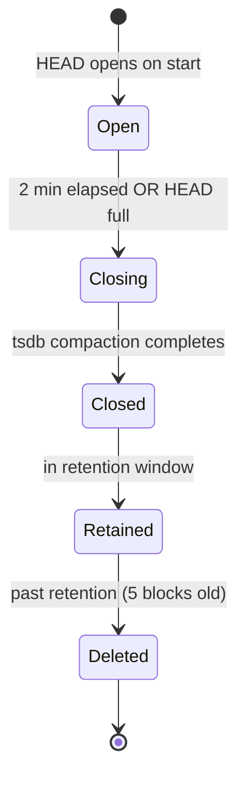

# Storage and Query

**Status:** Draft, 2026-05-17 — **amended by [ADR-0025](decisions.md#adr-0025-v05-vertical-slice-implementation-decisions) (2026-07-29)** for the v0.5 vertical slice. Where this doc and ADR-0025 disagree, the ADR wins. The deltas:

- The metric store is `internal/store` (not `pkg/store`, per ADR-0024) and embeds the full `tsdb.DB` via `tsdb.Open` with 2-min blocks / 10-min retention — not a raw `head.NewHead` (§2.1). The `Store`/`Engine` Go interfaces sketched in §2.4 and §4.1 were deleted with ADR-0024; the store's consumer is the binary.
- Ingest is a 1 s self-scrape of the agent's in-process Prometheus registry (§2.4's event-dispatch write path assumed the enricher pipeline that ADR-0021 removed).
- Fan-out is at the **storage layer**: agents serve raw series over gRPC, the query server merges and runs the stock PromQL engine centrally. §5.1's per-node partial-aggregation scheme is superseded (it mis-aggregates non-decomposable queries). §5.3's degraded/`missing_nodes` contract stands.
- The span/edge ring buffer (§3) landed re-shaped by [ADR-0026](decisions.md#adr-0026-v05-breadth-implementation-decisions) §5: a spans-only, in-memory ring of **raw OTLP** (resource + span) fed by the capture bridge's raw tee, with live Subscribe (drop-oldest + gap markers) — no span WAL (§3.4 dropped), and edges deferred until a producer exists (the dual-attributed L4 flow metrics answer topology queries meanwhile). CEL (§4.2) evaluates agent-side against OTLP field paths.
- §2.5's per-batch WAL fsync is tsdb's segment/page policy in practice (no per-commit knob); the crash-loss window stays inside the 30 s budget (ADR-0026 §4).

**Owners:** TBD

This document specifies the in-cluster store, the query engines on top of it, and the data schema. It implements [ADR-0002](decisions.md#adr-0002-in-cluster-store--prometheus-tsdb-head-block--parallel-ring-buffer), [ADR-0008](decisions.md#adr-0008-query-language), and [ADR-0012](decisions.md#adr-0012-tsdb-block-duration-and-wal-strategy), and satisfies requirements §2.3, §2.5, and §2.6 ([`docs/requirements.md`](../requirements.md)).

## 1. Why two stores

Captured records come in three shapes that map awkwardly onto a single storage engine:

| Shape | Example | Natural model |
|---|---|---|
| Time-series metric | `http_requests_total{service="cart", code="200"}` | Labeled counter / gauge / histogram → Prometheus tsdb |
| Span | `HTTP GET /users/42 took 12ms`, with attributes | Append-only record stream |
| Topology edge | "`frontend-7f...` → `cart-9b...` over TCP/8080, 142 conns last min" | Stream of typed edge records |

We use **Prometheus tsdb HEAD** for metrics (it is the best embeddable label-indexed time-series store available in Go) and a **typed in-memory ring buffer** for spans and edges. The ring buffer is small, simple, and CEL-queryable.

Both back themselves to disk for crash recovery. Both share the same WAL directory layout and snapshot cadence to simplify ops.

## 2. The metric store: Prometheus tsdb HEAD

### 2.1 Why tsdb HEAD and not full tsdb

The full Prometheus `tsdb.DB` opens the HEAD plus historical blocks on disk and runs compaction. We don't need historical blocks (10-min retention; long-term storage is in external sinks). We only need:

- The HEAD block (current in-memory series + chunks)
- WAL for crash recovery
- Periodic compaction of HEAD → closed block → drop (FIFO)

Thanos and Cortex use the HEAD block directly via `tsdb/head.NewHead(...)`. We follow the same pattern. The relevant Go imports are:

```go
import (
    "github.com/prometheus/prometheus/tsdb"
    "github.com/prometheus/prometheus/tsdb/wal"
    "github.com/prometheus/prometheus/tsdb/chunks"
)
```

### 2.2 Configuration

| Parameter | Default | Notes |
|---|---|---|
| Block duration | 2 min ([ADR-0012](decisions.md#adr-0012-tsdb-block-duration-and-wal-strategy)) | Matches snapshot cadence |
| Retention | 10 min (5 blocks) | Configurable via `obsapi.Config.Retention` |
| WAL directory | `/var/lib/ollie/wal/metrics/` | Per agent |
| Block directory | `/var/lib/ollie/blocks/metrics/` | Per agent |
| Max samples per HEAD | 1.5 M | Sized for ~50k active series × ~30 chunks |
| Stripe size | 16384 | tsdb default; tune per benchmark |
| Snapshot cadence | every 30 s | Triggered by background ticker; tsdb compaction handles it |

### 2.3 Sizing math (default workload)

Target: ≤200 MB RSS per agent for the metric store under the standard canary workload.

Standard canary: 50 pods/node, each emitting on average 10 distinct metric series (HTTP req-count split by status, latency histogram with 8 buckets, TCP bytes rx/tx, conn count). 50 × 10 = **500 series/node**.

Sample rate per series: scrape-aligned at ~1/s; with 10-min retention that's 600 samples per series. Total samples retained: **300k**.

tsdb HEAD memory cost dominated by chunk overhead (~50 bytes per chunk header) and per-sample storage (~2 bytes after compression). Estimate:
- Chunks: 500 series × ~5 open chunks = 2500 chunks × 50B = 125 KB
- Samples: 300k × 2B = 600 KB
- Postings / label indexes: ~10 MB on this cardinality
- WAL buffer: ~5 MB

**Total: ~16 MB metric store RSS** for the canary. Headroom for 10× cardinality before we approach the 200 MB target. Stress tests at 50k series/node validate the upper bound (see [`testing-and-benchmarks.md`](testing-and-benchmarks.md)).

### 2.4 Write path

`store.Store.WriteMetric(...)` is called by the agent's writer:

```go
// Stability: Stable
type Store interface {
    // Metrics — go to tsdb HEAD.
    WriteMetric(ctx context.Context, m Metric) error
    Appender() tsdb.Appender                  // for batched writes

    // Spans / edges — go to ring buffer.
    WriteSpan(ctx context.Context, s Span) error
    WriteEdge(ctx context.Context, e Edge) error

    // Read surface.
    Querier(min, max int64) (storage.Querier, error)   // PromQL backend
    SpanReader() SpanReader                            // CEL backend
    EdgeReader() EdgeReader                            // CEL backend

    // Lifecycle.
    Close() error
}
```

A write batch from the enricher arrives as a `[]Event` (per [`obi-integration.md`](obi-integration.md) §2.1). The writer dispatches by `Event.Kind` to `WriteMetric` / `WriteSpan` / `WriteEdge`. Tsdb appends are batched per scrape interval (default 1s) to amortize WAL fsyncs.

### 2.5 WAL and crash recovery

WAL is enabled (`tsdb.NewHead(..., walDir, ...)`). On agent restart:
1. Open the HEAD with the existing WAL directory.
2. tsdb replays the WAL into HEAD memory.
3. Any closed blocks on disk are loaded.
4. Compaction resumes on schedule.

A full agent crash loses at most **30 s** of in-flight non-WAL writes (the snapshot cadence). The WAL itself is fsynced per batch.

### 2.6 Block lifecycle



Closed blocks live in `blocks/metrics/<ULID>/`. The compactor drops blocks outside the retention window on each cycle.

## 3. The span/edge store: typed ring buffer

### 3.1 Why a ring buffer

Spans and edges don't fit tsdb. They have:
- High-cardinality attributes (trace IDs, request paths, peer IPs) that we don't want as tsdb labels
- Variable-shape attribute maps that PromQL can't query well
- A natural "last N records" query pattern that's a ring's strength

A 64k-entry ring (configurable) per agent covers our retention budget at typical span rates with bounded memory.

### 3.2 Shape

```go
package store

// Stability: Stable
type SpanReader interface {
    // Range query: spans whose StartTime falls in [min, max]. Streamed.
    Range(ctx context.Context, min, max time.Time, filter CELProgram) (<-chan Span, error)
}

type EdgeReader interface {
    Range(ctx context.Context, min, max time.Time, filter CELProgram) (<-chan Edge, error)
}

// ring is the concrete implementation; not exported.
type ring[T any] struct {
    mu       sync.RWMutex
    buf      []T
    head     int           // next write index
    cap      int
    full     bool
    walEnc   *wal.Encoder  // shared WAL infra with metrics store
}
```

Two rings per agent: one for spans, one for edges. Ring entries are appended on `WriteSpan` / `WriteEdge`; readers grab a snapshot (RLock + copy of the relevant slice) for `Range`, then evaluate the CEL filter outside the lock.

### 3.3 Sizing

| Workload | Spans/sec/node | Ring capacity | Mean RSS |
|---|---|---|---|
| Canary (50 pods, 1 req/s) | 50 | 64k entries | ~20 MB |
| Stress (50 pods, 100 req/s) | 5000 | 64k entries | ~20 MB (oldest evicted) |
| AI-agent heavy (200 pods, 10 req/s) | 2000 | 256k entries | ~80 MB |

Each ring entry averages ~300 bytes (struct + small attribute map). Capacity is `obsapi.Config` knob (`SpanRingCapacity`, `EdgeRingCapacity`).

### 3.4 WAL for spans/edges

Spans and edges share the WAL directory layout (`/var/lib/ollie/wal/spans/`, `…/edges/`) but use a simpler frame format (length-prefixed protobuf, no chunks). Replay on start refills the ring up to its capacity from the most recent WAL segments.

## 4. Query languages

Per [ADR-0008](decisions.md#adr-0008-query-language): PromQL for metrics, CEL for spans/edges.

### 4.1 PromQL for metrics

The query engine is `github.com/prometheus/prometheus/promql.Engine`, instantiated against our `store.Querier`. Standard PromQL — no extensions. Functions, operators, aggregations all work.

Public Go surface in `pkg/query`:

```go
// Stability: Stable
type Engine interface {
    // PromQL.
    QueryInstant(ctx context.Context, q string, ts time.Time) (promql.Vector, error)
    QueryRange(ctx context.Context, q string, start, end time.Time, step time.Duration) (promql.Matrix, error)

    // CEL for spans / edges.
    QuerySpans(ctx context.Context, expr string, start, end time.Time) (<-chan Span, error)
    QueryEdges(ctx context.Context, expr string, start, end time.Time) (<-chan Edge, error)
}
```

### 4.2 CEL for spans and edges

[CEL](https://github.com/google/cel-go) is the standard in-cluster filtering language (Kubernetes uses it for admission policy). It's deterministic, sandboxed, and has a small Go runtime.

CEL programs are compiled against the OTLP proto types for `Span` and `Edge` so that field paths match what AI agents and ops users already know:

```go
import "github.com/google/cel-go/cel"

env, _ := cel.NewEnv(
    cel.Types(&pb.Span{}, &pb.Edge{}),
    cel.Variable("span", cel.ObjectType("ollie.v1.Span")),
)
```

A compiled `CELProgram` is reusable across `Range` calls. The query server caches compiled programs per `(expr, table)`.

### 4.3 Worked examples

#### HPA example

Goal: scale the `backend` Deployment when average HTTP requests-per-second across its pods exceeds 100.

The HPA queries the custom-metrics API:

```
GET /apis/custom.metrics.k8s.io/v1beta1/namespaces/shop/deployments/backend/qps
```

Our APIService implementation translates that to PromQL:

```promql
avg(rate(ollie_http_requests_total{
  k8s_namespace_name="shop",
  k8s_deployment_name="backend"
}[1m]))
```

…fans it out to all node-local stores, sums the per-node partial results in the query server, and returns:

```json
{
  "kind": "MetricValueList",
  "apiVersion": "custom.metrics.k8s.io/v1beta1",
  "items": [{
    "describedObject": {"kind": "Deployment", "namespace": "shop", "name": "backend"},
    "metricName": "qps",
    "timestamp": "2026-05-17T12:34:56Z",
    "value": "137"
  }]
}
```

The HPA scales accordingly.

#### AI agent example

Goal: an AI agent watching for slow requests in the `payments` namespace, streamed live.

```cel
span.attributes["k8s.namespace.name"] == "payments" &&
span.duration_ms > 100
```

The agent connects to the streaming sink and subscribes with this CEL expression. The query server compiles it once, fans it out to all node-local stores with the same filter, and forwards matching spans as they arrive. Each `Span` is wire-encoded as OTLP `Span` proto so downstream OTel tooling consumes it directly.

#### Prometheus scrape example

Operators point an existing Prometheus server at the agent's `/metrics` endpoint (exposed by the built-in `PullSink`). The output is the standard text exposition format, with our metric names (`ollie_*` prefix) and OTel-derived labels:

```
# HELP ollie_http_requests_total HTTP requests captured by source pod and peer
# TYPE ollie_http_requests_total counter
ollie_http_requests_total{k8s_namespace_name="shop",k8s_deployment_name="backend",http_method="GET",http_status_code="200",peer_k8s_namespace_name="shop",peer_k8s_deployment_name="frontend"} 4231
…
```

## 5. Fan-out semantics

The query server is stateless; all data lives on the agents. Every query is fanned out.

### 5.1 Fan-out algorithm

```mermaid
sequenceDiagram
    participant Caller
    participant QSrv as Query Server
    participant A1 as Agent (node 1)
    participant A2 as Agent (node 2)
    participant An as Agent (node N)

    Caller->>QSrv: Query (PromQL or CEL)
    QSrv->>QSrv: list registered agents
    par
        QSrv->>A1: QueryAgent (per-node deadline)
        QSrv->>A2: QueryAgent (per-node deadline)
        QSrv->>An: QueryAgent (per-node deadline)
    end
    A1-->>QSrv: partial result
    A2-->>QSrv: partial result
    An--xQSrv: deadline expired
    QSrv->>QSrv: aggregate; mark degraded=true
    QSrv-->>Caller: result with degraded flag
```

Per-node deadline = `0.8 × overall deadline`. Aggregation:
- **PromQL:** sum/avg/max/min as appropriate per the outermost aggregation; for `rate`/`increase`, the partials are themselves rates and summed.
- **CEL streams:** the query server multiplexes per-node streams into one output stream; ordering is best-effort by `StartTime` within a per-node-batch window of 1s.

### 5.2 Deduplication

For metrics: deduplication is by `(__name__, labels, timestamp)`. Identical samples from two agents (rare — would indicate a misconfiguration) are merged via PromQL's natural duplicate handling.

For spans: deduplication by `(trace_id, span_id)`. Streaming readers drop duplicates with a 1k-entry LRU per stream.

For edges: deduplication is **not** performed. Edges are aggregated 5-tuple-per-minute counters; two agents reporting the same edge means two pods on different nodes hit the same peer, which is the correct (additive) interpretation.

### 5.3 Consistency model

**Bounded staleness.** Caller is guaranteed to see all data that was committed to a node-local store ≥ `query_lag` ago, where `query_lag` defaults to 2 seconds. Reads do not block on fresh writes.

Partial results are returned with `degraded=true` and a `missing_nodes=["node-3", ...]` list when any fan-out target misses its deadline. Callers (notably the HPA APIService adapter) decide how to react; the HPA adapter returns the partial result unmarked as a heuristic ("HPA gets a slightly-low number rather than no number") and increments a counter.

## 6. Data schema

### 6.1 Metric schema

All metric names are `ollie_*` prefixed. Labels follow OTel K8s semantic conventions. The core set:

| Metric | Type | Labels | Source |
|---|---|---|---|
| `ollie_tcp_bytes_rx_total` | counter | base + `peer_*` | OBI L4 |
| `ollie_tcp_bytes_tx_total` | counter | base + `peer_*` | OBI L4 |
| `ollie_tcp_connections_total` | counter | base + `peer_*` + `direction` (in/out) | OBI L4 |
| `ollie_tcp_rtt_seconds` | gauge | base + `peer_*` | OBI L4 |
| `ollie_tcp_retransmits_total` | counter | base + `peer_*` | OBI L4 |
| `ollie_http_requests_total` | counter | base + `peer_*` + `http_method` + `http_status_code` + `http_route` | OBI HTTP* |
| `ollie_http_request_duration_seconds` | histogram | base + `peer_*` + `http_method` + `http_route` | OBI HTTP* |
| `ollie_http_response_duration_seconds` | histogram | base + `peer_*` + `http_method` + `http_route` | OBI HTTP* |
| `ollie_grpc_requests_total` | counter | base + `peer_*` + `rpc_service` + `rpc_method` + `rpc_grpc_status_code` | OBI gRPC |
| `ollie_grpc_request_duration_seconds` | histogram | base + `peer_*` + `rpc_service` + `rpc_method` | OBI gRPC |

**Base labels** (every metric):
- `k8s_pod_name`, `k8s_pod_uid`, `k8s_namespace_name`
- `k8s_deployment_name` (or `_statefulset_name` / `_daemonset_name` / `_job_name` — the resolved workload owner; exactly one present)
- `k8s_node_name`
- `service_name` (resolved K8s Service for the source pod, if any)

**Peer labels** (`peer_*` prefix), where resolvable:
- `peer_k8s_pod_name`, `peer_k8s_namespace_name`, `peer_k8s_deployment_name`, `peer_service_name`
- `peer_external` (boolean) when the peer is outside the cluster
- `peer_ip` (only when no K8s identity resolves, to keep cardinality bounded)

**Histogram buckets** (default; configurable):
- Duration: `0.001, 0.005, 0.01, 0.025, 0.05, 0.1, 0.25, 0.5, 1, 2.5, 5, 10` seconds
- Bytes: `100, 1000, 10000, 100000, 1000000, 10000000, 100000000`

### 6.2 Span schema

OTel `Span` shape per the OTel proto. Attribute keys follow OTel semconv with our `peer_k8s_*` additions. `service.name` is set to the source pod's resolved K8s Service; `service.instance.id` to the pod UID.

### 6.3 Edge schema

A typed record:

```go
type Edge struct {
    Timestamp time.Time
    Source    topology.Identity
    Peer      topology.Identity
    Protocol  string           // "tcp", "http", "grpc"
    SrcPort   uint16
    DstPort   uint16
    Conns     uint64           // total connections in the aggregation window
    BytesRx   uint64
    BytesTx   uint64
    Attrs     map[string]string  // peer_external, etc.
}
```

Edges are aggregated per `(source pod, peer identity, protocol, peer port)` over a configurable window (default 30 s) before being written. This keeps the ring small while preserving "service A talks to service B" topology fidelity.

## 7. Server-side aggregation for HPA

Per requirement §2.6, the system must make "avg req/sec across pods of a backend service" trivial. Three mechanisms cooperate:

1. **Standard label set** (§6.1) makes service-level grouping trivial in PromQL.
2. **HPA APIService adapter** at the query server translates `/apis/custom.metrics.k8s.io/v1beta1/.../{metric}` paths into PromQL queries grouped by the addressed object. Supported objects: `Pod`, `Deployment`, `StatefulSet`, `Service` (via Deployment owner-ref resolution).
3. **Fan-out aggregation** (§5.1) merges per-node partial results without the caller having to know about nodes.

The adapter exposes the following metric paths by default (configurable):

| Path | PromQL template |
|---|---|
| `/.../qps` | `avg(rate(ollie_http_requests_total{...selector...}[1m]))` |
| `/.../latency_p50` | `histogram_quantile(0.5, sum by(le)(rate(ollie_http_request_duration_seconds_bucket{...}[1m])))` |
| `/.../latency_p99` | same with 0.99 |
| `/.../bytes_in_per_sec` | `avg(rate(ollie_tcp_bytes_rx_total{...}[1m]))` |
| `/.../bytes_out_per_sec` | same for tx |
| `/.../conn_rate` | `avg(rate(ollie_tcp_connections_total{...}[1m]))` |

Operators add new derived metrics by editing the adapter config (a ConfigMap mapping metric path → PromQL template) — no recompilation.

## 8. Self-observability of the store

The store exposes its own Prometheus metrics on the standard self-observability endpoint:

| Metric | Type | Meaning |
|---|---|---|
| `ollie_store_active_series` | gauge | tsdb HEAD active series count |
| `ollie_store_samples_appended_total` | counter | total samples written |
| `ollie_store_wal_fsync_seconds` | histogram | WAL fsync latency |
| `ollie_store_compactions_total` | counter | tsdb block compactions |
| `ollie_store_ring_entries` | gauge | per-ring (spans, edges) current entry count |
| `ollie_store_ring_drops_total` | counter | per-ring evictions due to capacity |
| `ollie_query_duration_seconds` | histogram | per-language (`promql`, `cel`) query latency |
| `ollie_query_fanout_degraded_total` | counter | queries returned with `degraded=true` |

## Open questions

1. **WAL fsync strategy.** Per-batch fsync gives at-most-30s loss; per-sample is too slow; per-segment is the middle ground. Default starts at per-batch, knob exposed.
2. **Edge aggregation window.** 30 s is a guess. Validate against AI-agent topology-derivation patterns once a real consumer exists.
3. **Long-term storage adapter shape.** Out of scope here; see [`sinks-and-extensibility.md`](sinks-and-extensibility.md). The store does **not** know about external storage.
4. **Higher-cardinality histograms.** Native histograms (Prometheus 2.40+) are a future optimization for latency. Default to classic buckets in v1; add a `useNativeHistograms` toggle for evaluation.
