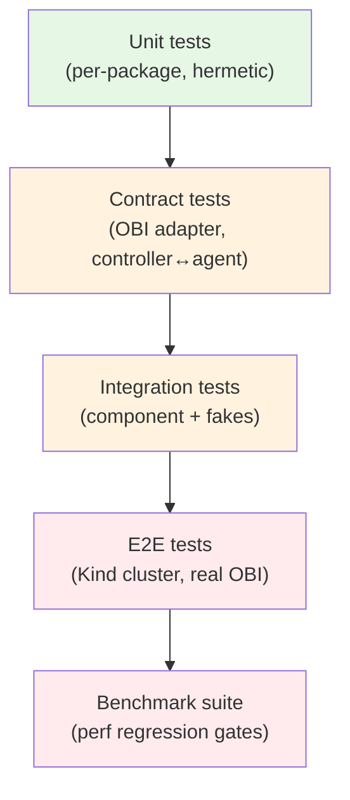

# Testing and Benchmarks

**Status:** Draft, 2026-05-17
**Owners:** TBD

This document defines the test pyramid, the canary workloads we benchmark against, the performance regression gates wired into CI, and the kernel/distro matrix. Every performance claim made elsewhere in this design only stands because something here verifies it.

The project's resource budgets live in [`data-plane.md`](data-plane.md) §5; this doc says how we enforce them.

## 1. Test pyramid

Five tiers, each running at a different cadence:



| Tier | Runs on | Cadence | Owner |
|---|---|---|---|
| Unit | every push (`ap test //...`) | seconds | per-package |
| Contract | every push (`ap test //...`) | tens of seconds | `pkg/capture`, `pkg/controller` |
| Integration | every push | low minutes | per-component, lives next to the component |
| E2E | every PR, nightly | tens of minutes | `tests/e2e/` |
| Benchmark | every PR (smoke), nightly (full) | hour-scale (full) | `tests/bench/` |

`ap test //...` runs unit + contract + integration. E2E and Benchmark are gated by `RUN_E2E=1` and `RUN_BENCH=1` env vars per the existing convention.

## 2. Unit tests

Per-package, hermetic, fast. Conventions:

- Subtest tables (`t.Run(name, …)`) for variant coverage.
- `testdata/` for fixtures.
- `internal/testutil/` for shared helpers but no test logic in `pkg/`.
- Coverage target: **≥ 80%** for `pkg/*`. Tracked in CI; PRs that drop coverage by >2% get auto-commented (advisory, not blocking).
- All public APIs in `pkg/` get exemplary godoc-runnable examples (`ExampleXxx` funcs).

Unit tests **do not** load eBPF, hit kernels, or open ports. Anything that would is integration or higher.

## 3. Contract tests

The OBI adapter contract suite is the most important non-obvious test investment in the project. Full spec in [`obi-integration.md`](obi-integration.md) §4. Summary:

- Location: `tests/contract/obi/`
- Drives the `pkg/capture` adapter against pinned input fixtures, diffs `Event` output against goldens.
- Required to pass without retries on every PR.
- Augmented on every OBI bump.

A second contract suite covers the controller↔agent gRPC wire shape at `tests/contract/controlplane/`:

- Replay recorded controller messages against a captured agent state and assert idempotent application.
- Replay recorded agent statuses against a captured controller state and assert correct CR status updates.
- Protects against silent breakages in the wire format separate from generated `.pb.go` files.

## 4. Integration tests

Live next to the component they test. Use fakes for boundaries the component doesn't own:

- `pkg/capture` integration: in-memory event source feeding the adapter (no OBI, no kernel).
- `pkg/controller` integration: `controller-runtime`'s `envtest` (real CRD server, no eBPF).
- `internal/store` integration: real tsdb against a tmp directory.
- Egress integration: each surface against a fake destination (httptest server for OTLP HTTP, in-process gRPC server for OTLP gRPC and streaming subscribe, etc).

Integration tests verify component-internal invariants and contracts with declared dependencies. They are not load tests.

## 5. E2E tests

Real Kind cluster, real OBI, real kernels. Reuses the harness pattern from the existing `opentelemetry/tests/e2e/harness.go` (Kind lifecycle, docker build/load, kubectl helpers) — that harness moves to `tests/e2e/harness.go` with extensions.

### 5.1 Scenarios

| Scenario | Verifies |
|---|---|
| Install + smoke | All manifests apply; CRDs register; agent/controller/query reach Ready |
| TrafficMonitor reconcile | Create `TrafficMonitor`, observe matched pod count, see real captures in store |
| HPA loop | Create `TrafficMonitor` + HPA pointing at our custom-metrics API; load generator drives QPS up; HPA scales the target Deployment |
| Identity attribution | Two pods talk; verify both `k8s.*` and `peer.k8s.*` set on the metric |
| OBI module toggle | Enable then disable HTTP module via CR edit; verify event flow stops/starts |
| Streaming sink | gRPC client subscribes with CEL filter; load generator fires matching + non-matching traffic; verify only matching arrives |
| Controller failover | Kill leader controller pod; verify agents reconnect to new leader; capture continues |
| Agent crash | Kill agent pod; verify DaemonSet restart; verify WAL replay (no missing recent metrics outside the loss window) |
| Cardinality cap | Create a workload generating 1000s of unique paths without templating; verify cardinality cap engages and metric is alarmed |
| TLS capture | TLS-enabled httpbin pod with OpenSSL; verify decrypted L7 attributes (method, path, status) appear |
| GenAI capture | Pod making OpenAI-compatible API calls; verify GenAI span attributes appear |

Each scenario is a single `*_test.go` file under `tests/e2e/scenarios/`.

### 5.2 Harness API (extending the existing one)

```go
// tests/e2e/harness.go — extends the opentelemetry/ harness pattern
type Harness struct { /* Kind cluster, kubeClient, etc. */ }

func New(t *testing.T, name string) *Harness
func (h *Harness) Setup() // creates Kind cluster, installs our manifests
func (h *Harness) Teardown()

// Image and deploy helpers (reused from existing harness).
func (h *Harness) DockerBuild(tag, dockerfile, ctx string)
func (h *Harness) KindLoad(tag string)
func (h *Harness) KubectlApplyFile(path string)
func (h *Harness) KubectlApplyContent(yaml string)

// New helpers for our project.
func (h *Harness) CreateTrafficMonitor(ns string, spec obsv1alpha1.TrafficMonitorSpec) *obsv1alpha1.TrafficMonitor
func (h *Harness) WaitForCondition(obj runtime.Object, cond string, timeout time.Duration)
func (h *Harness) QueryPromQL(q string) promql.Vector
func (h *Harness) QueryCEL(table string, expr string) []sink.Event
func (h *Harness) GenerateLoad(spec LoadSpec) // wraps wrk / h2load / ghz
```

## 6. Benchmark suite

Lives at `tests/bench/`. Two modes:

- **Smoke** — runs on every PR. ~5 minutes total. Validates the headline numbers haven't moved dramatically (within 10%).
- **Full** — runs nightly + on release. ~1 hour. Sweeps cardinality and load, produces flamegraphs, exports results to a perf-results bucket (TBD).

### 6.1 Canary workloads

Each has a deterministic load profile. Located under `tests/bench/workloads/`.

| Workload | Generator | Protocol | Baseline rate | Stress rate | Cardinality |
|---|---|---|---|---|---|
| `http1-nginx` | `wrk` | HTTP/1.1 | 1 k req/s/pod | 10 k req/s/pod | 10 routes |
| `http2-nginx` | `h2load` | HTTP/2 | 1 k req/s/pod | 10 k req/s/pod | 10 routes |
| `grpc-echo` | `ghz` | gRPC | 1 k req/s/pod | 10 k req/s/pod | 1 service × 3 methods |
| `tls-httpbin` | `wrk` over TLS (OpenSSL) | HTTPS/1.1 | 500 req/s/pod | 5 k req/s/pod | 10 routes |
| `go-tls-server` | `wrk` over TLS (Go `crypto/tls`) | HTTPS/1.1 | 500 req/s/pod | 5 k req/s/pod | 10 routes |
| `a2a-mock` | custom A2A client | HTTP+SSE | 100 req/s/pod | 1 k req/s/pod | 5 agent IDs |
| `genai-mock` | OpenAI-API-compatible client → mock | HTTP/1.1 | 50 req/s/pod | 500 req/s/pod | 3 models |
| `kafka-mock` | (roadmap) | Kafka | — | — | — |

Each workload is a pair: a server image (`tests/bench/workloads/<name>-server/`) and a client (`<name>-client/`). Both are deployed as small Deployments in Kind.

### 6.2 Standard cluster topology

For repeatability, all benchmarks run against:

- **Smoke:** 3-node Kind cluster, 10 pod replicas per workload.
- **Full:** 5-node Kind cluster, 50 pod replicas per workload, 30-minute steady-state per measurement.

CI runners are GitHub-hosted (free tier capacity); the bench machine class is documented per CI workflow so reruns reproduce.

### 6.3 Measurements

Captured per workload, per scenario:

| Measurement | How | Gate (smoke) | Gate (full) |
|---|---|---|---|
| Agent CPU (avg over 60s) | `kubectl top pod` + cAdvisor | regression > 25% | budget violation |
| Agent RSS (max over 60s) | cAdvisor | regression > 25% | budget violation |
| Agent goroutine count | self-observability metric | regression > 50% | regression > 25% |
| Per-event enrichment latency | `go test -bench` | regression > 50% | regression > 20% |
| End-to-end event latency p99 | timestamps in spans | regression > 50% | regression > 20% |
| Sink write latency p99 | sink self-observability | regression > 50% | regression > 20% |
| Store WAL fsync p99 | store self-observability | regression > 50% | regression > 20% |
| HPA scale-out latency (load up → replica added) | E2E timer | regression > 50% | budget: ≤ 60 s |

"Regression" compares the PR vs. the merge-base. "Budget violation" is an absolute threshold from [`data-plane.md`](data-plane.md) §5.

### 6.4 Regression gates

Smoke runs on every PR. If any smoke gate trips, CI fails with an annotation pointing at the workload + metric. Re-runs are explicit (`/bench rerun` PR command); flake retries are not auto.

Full runs nightly. Failures open a tracking issue tagged `perf-regression`.

A weekly report (auto-generated) summarizes p50/p99 trends per metric per workload.

### 6.5 Profiling artifacts

The full benchmark run produces:
- Goroutine CPU and heap profiles (pprof, per agent)
- Flamegraph SVGs
- eBPF program statistics (per-program runtime histograms, via `bpftool prog show`)
- Per-OBI-module event-rate breakdown

All artifacts uploaded to the same perf-results bucket, retained 90 days.

## 7. Kernel and distro matrix

Per [ADR-0006](decisions.md#adr-0006-kerneldistro-target--cos-125-kernel-6x-btfco-re-required), the floor is **COS 125+ / kernel 6.x / BTF**. CI rotates through:

| Image | Kernel | Source | Cadence |
|---|---|---|---|
| `kindest/node:v1.32.x` (default Kind base) | matches GitHub runner host kernel | upstream Kind | every PR |
| COS 125 image | 6.x | gcr.io/cos-cloud (when GitHub adopts COS host) or VM-launched in CI nightly | nightly |
| Latest GKE stable node image | latest stable kernel | GKE published image | nightly |
| Arm64 variant of the above | matching | nightly | nightly |

Arm64 coverage is non-negotiable; OBI supports it and many GKE workloads run on Arm.

The contract test "Hermetic kernel" category ([`obi-integration.md`](obi-integration.md) §4.2) runs a lightweight QEMU image of a kernel-6.x build to verify CO-RE relocation works without depending on the CI host kernel.

## 8. Self-observability is tested

Every release blocker has a corresponding "we can see this happening" test:

- Every metric documented in any `_self-observability_` section of any design doc must exist and be tested non-zero in at least one E2E scenario.
- Every `Condition` we set on a CR is tested.
- Every component exposes a `/healthz/ready` and `/healthz/live` and E2E asserts they reflect reality.

This is enforced by a meta-test that grep-walks design docs for documented metric names and asserts they appear in test assertions somewhere.

## 9. Fuzz and property tests

For the trickier surfaces:

- **CEL programs** — fuzz CEL inputs to ensure no panic / no infinite loop / no excessive memory under operator-controlled expressions.
- **PromQL** — Prometheus's own engine is well-fuzzed upstream; we don't re-fuzz, but we do regression-test specific aggregations.
- **CRD validating webhook** — fuzz CR shapes against the schema to catch panics.
- **OBI adapter event translation** — property tests for the round-trip (OBI event → `Event` → OTLP form → re-decode) where applicable.

## 10. Test artifacts and dev ergonomics

- `ap test //...` runs unit + contract + integration across all AP roots.
- `ap e2e .` runs E2E for the AP root (repo root).
- `ap bench core` (new ap subcommand if not present; otherwise a thin `tests/bench/run.sh`) runs the smoke benchmarks locally.
- All test fixtures live in `testdata/` directories adjacent to the test file.
- CI uploads benchmark artifacts to `${ARTIFACTS}` per the existing presubmit convention.

## 11. What CI looks like

Adds to the existing `.github/workflows/ci-presubmits.yaml`:

| Job | Wrapping script | When |
|---|---|---|
| `ap-build` | existing | every push |
| `ap-lint` | existing | every push |
| `ap-test` | existing, now includes contract suites | every push |
| `ap-e2e` | new — `dev/ci/presubmits/ap-e2e` | every PR |
| `ap-bench-smoke` | new — `dev/ci/presubmits/ap-bench-smoke` | every PR |
| `ap-bench-full` | new — `dev/ci/presubmits/ap-bench-full` | nightly |
| `ap-kernel-matrix` | new — `dev/ci/presubmits/ap-kernel-matrix` | nightly |
| `ap-verify-generate` | existing | every push |

Each wrapper script follows the existing pattern: 20–30 lines of bash that `cd`s to repo root and invokes `go run github.com/gke-labs/gke-labs-infra/ap@latest <cmd>`.

## Open questions

1. **Perf-results bucket.** We need a stable target for artifact + measurement uploads. GCS bucket TBD; rotate through workflow secrets to avoid hard-coding.
2. **GitHub-hosted runners for nightly full benchmarks.** Default 2-vCPU runners may not be enough for stress-rate tests. Likely need self-hosted runners or larger runner classes; cost TBD.
3. **Synthetic A2A workload realism.** Until A2A protocol semantics stabilize, the `a2a-mock` workload is "JSON-RPC over HTTP/SSE shaped like our best guess." Re-base it once A2A semconv lands.
4. **End-user perf reporting.** Should we expose a "run this and send us your numbers" CLI for operators? Useful for OBI version validation in environments we can't reproduce. Defer.
