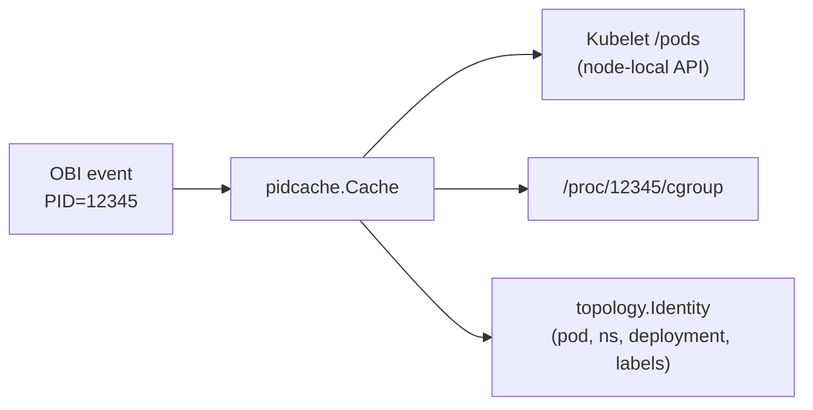
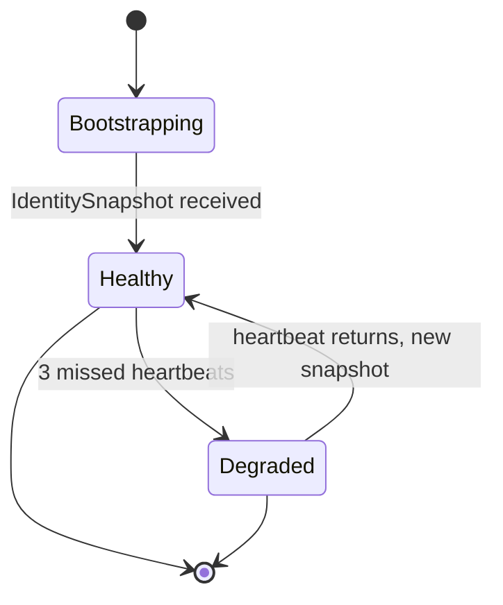

# Topology

**Status:** Draft, 2026-05-17 — **superseded in substance by [ADR-0021](decisions.md#adr-0021-lean-v03--agent-re-uses-obis-native-enrichment) and [ADR-0026](decisions.md#adr-0026-v05-breadth-implementation-decisions) (2026-07-29).** The identity plane this doc designs (canonical informer → broadcast → agent `IdentityCache` → enricher, §3–§6) was never built: OBI's own informer resolves K8s identity in-process and stamps **both sides** of L4 flows at owner granularity (`k8s.src.*`/`k8s.dst.*`, fixture-verified), which serves every current consumer. #101–#103 closed on that evidence. This doc is retained for the reopen case — L7 metric peer identity or explicit external-peer labeling — and for the Edge schema sketch (production of edges is likewise deferred, ADR-0026 §5).
**Owners:** TBD

This document specifies how the system attaches Kubernetes identity to every captured record, on both ends of a connection — the source pod and the peer. It implements [ADR-0005](decisions.md#adr-0005-topology-via-kubelet-pid-mapping--k8s-informer) and [ADR-0009](decisions.md#adr-0009-informer-custody--hybrid), and satisfies requirement §2.1's topology metadata clause.

Topology is the difference between "node 10.0.5.32 sent 142 packets to 10.0.7.14" and "the `frontend` deployment in `shop` sent 142 packets to the `cart` deployment in `shop`." The latter is what HPA, AI agents, and operators actually want.

## 1. The two attribution problems

Captured records arrive from OBI with a PID (the source) and a peer IP (the destination). We need to turn each into a `topology.Identity`:

| Direction | Input | Lookup | Output |
|---|---|---|---|
| **Source** | `PID` | local-node cache backed by Kubelet + cgroup | `Identity` of the containing pod |
| **Peer** | `IP` (sometimes + port) | cluster-wide cache backed by K8s informer | `Identity` of the pod/service on the other end |

The two problems are decoupled. Source attribution is **local** and fast (lookups never cross the node). Peer attribution is **cluster-wide** and needs a coherent view of pod and service IPs.

## 2. Source attribution: PID → local Pod

### 2.1 Mechanism



The cache is built in three steps:

1. **Kubelet `/pods` snapshot.** On agent start, query `https://127.0.0.1:10250/pods` (via the pod's serviceaccount token + node-local TLS) to get the list of pods running on this node and their containers (container ID, image, statuses).
2. **PID enumeration.** Walk `/proc/<pid>/cgroup` for every PID, extract the container ID (the standard kubepods cgroup path embeds it), and join against the Kubelet pod list.
3. **Owner resolution.** The Kubelet response includes pod ownerReferences. For each pod, walk one hop up to get the workload owner (`Deployment` via the intermediate `ReplicaSet`, `StatefulSet`, `DaemonSet`, `Job`).

The cache is refreshed:
- **On demand** when a PID lookup misses (rate-limited per PID to avoid floods).
- **Periodically** every 30 s as a sweep.
- **On pod events** received from the controller's identity broadcast (the agent uses the same broadcast for cluster-wide *and* node-local pod updates — controller informer is the source of truth even for local pods).

### 2.2 Why `/proc/<pid>/cgroup` and not OBI's own PID-to-pod

OBI's K8s integration is partially present (Beyla pioneered it). However:
- OBI is v0 and the API for "give me current PID→pod state" is not stable enough to depend on directly.
- We want one source of truth across modules and across attribute namespaces.
- The `/proc/cgroup` + Kubelet approach is industry-standard (cAdvisor, Falco, Cilium all do it) and is what OBI itself uses internally.

The PID cache is small (one entry per process on the node, ~200 bytes per entry, typical node has a few hundred processes) and access is O(1) via a sync.Map under a RWMutex.

### 2.3 PID churn

Processes come and go (especially for ephemeral containers, init containers, short-lived workloads). Approach:
- **Stale entries** are kept for 60 s after `proc/<pid>` disappears so late-arriving events can still attribute.
- **PID reuse** is detected by comparing the pod UID at lookup time to the cached pod UID; mismatch → re-resolve.
- **Container restart** (same pod UID, new PIDs) is handled by the Kubelet refresh.

## 3. Peer attribution: IP → cluster-wide Identity

### 3.1 What we resolve

For every peer IP we attempt:

| Match | Identity |
|---|---|
| Pod IP in `Pod.Status.PodIPs` | The pod's identity (including its workload owner and Service if any) |
| Cluster IP in `Service.Spec.ClusterIPs` | The Service's identity |
| Endpoint IP in `EndpointSlice` for a headless Service | The Service's identity |
| Node IP in `Node.Status.Addresses` | The Node's identity (`peer.kind: Node`) |
| Anything else | `peer_external = true`; `peer_ip` recorded |

Resolution is best-effort and per-record latency-budgeted at ≤ 10 µs.

### 3.2 The IdentityCache

Per-controller, in-memory, three IP→Identity indexes:

```go
type IdentityCache interface {
    Lookup(ip net.IP) (topology.Identity, bool)
    LookupWithPort(ip net.IP, port uint16) (topology.Identity, bool) // for service:port disambiguation
    Snapshot() []IdentityRecord
    Watch(ctx context.Context) <-chan IdentityDelta
}
```

Three indexes because pods and services overlap in semantic but not in resolution path:
- `podByIP` — populated from Pod informer.
- `serviceByClusterIP` — populated from Service informer.
- `serviceByEndpointIP` — populated from EndpointSlice informer (for headless services and per-endpoint identity).

`Lookup` consults them in order: pod (most specific), service-by-cluster-IP, service-by-endpoint-IP. Conflict (rare; usually a misconfigured kube-proxy) goes to the most specific.

### 3.3 Watches and freshness

Informers use the standard `k8s.io/client-go/informers/factory` with a resync period of 30 minutes (enough to catch missed events; relist is cheap). The cache observes `Add`/`Update`/`Delete` and emits an `IdentityDelta` for each change.

For new pod IPs, freshness target is ≤ 1 s from K8s API event to agent-visible cache entry (one network hop: API server → controller informer → cache → gRPC stream → agent cache).

## 4. Hybrid custody: who runs the informer

Per [ADR-0009](decisions.md#adr-0009-informer-custody--hybrid):

- **Steady state:** the leader-elected controller runs the canonical informer. There is exactly one informer set per cluster regardless of node count. Agents do not watch pods/services.
- **Failover:** if the controller's heartbeat misses ≥ 3 intervals (15 s default), each agent activates a local fallback informer scoped to the same resources (Pods, Services, EndpointSlices). Once the controller is healthy again and the agent receives a fresh `IdentitySnapshot`, the local informer is **stopped** after a 60-s hold-down to avoid flapping.
- **Bootstrap:** when an agent first connects, the controller sends an `IdentitySnapshot` of the current cache, then sends deltas.



The local fallback informer runs against the agent's own kubeconfig (via the pod's ServiceAccount, which has the necessary read permissions per [`operations.md`](operations.md)).

## 5. Edge construction

An "edge" is a record summarizing observed traffic between two identities. Edges are derived from raw L4/L7 events in the enricher and aggregated in the data plane before write (see [`storage-and-query.md`](storage-and-query.md) §6.3).

### 5.1 Edge identity

A unique edge is keyed by:
- Source identity (pod-level)
- Peer identity (pod- or service-level)
- Protocol (`tcp`, `http`, `grpc`)
- Peer port

Source port is **not** part of the key (it changes per connection; aggregating across source ports gives the canonical "service A talks to service B" view).

### 5.2 Aggregation window

Default 30 s. Within a window, counters (conns, bytes, samples) accumulate. At window close, an `Edge` record is written. Configurable per `TrafficMonitor.spec.cardinality.aggregation`.

### 5.3 Topology graph construction

We do not store a derived "graph" — edges are first-class records consumers query directly. A UI or AI agent rebuilds the graph by streaming recent edges and grouping by `(source.identity, peer.identity)`.

This keeps the data model simple (no derived materialized view to maintain) at the cost of more work per consumer. Given the small per-cluster edge volume (typically <1k unique edges in steady state), this is the right trade-off.

## 6. Attribute namespace

We follow OTel K8s semantic conventions. Source attributes (set on every record):

| Attribute | Source |
|---|---|
| `k8s.pod.name` | Pod metadata.name |
| `k8s.pod.uid` | Pod metadata.uid |
| `k8s.namespace.name` | Pod metadata.namespace |
| `k8s.node.name` | this agent's nodeName |
| `k8s.container.name` | resolved from PID's container |
| `k8s.deployment.name` / `k8s.statefulset.name` / `k8s.daemonset.name` / `k8s.job.name` | resolved workload owner (exactly one) |
| `k8s.replicaset.name` | intermediate (Deployment only) |
| `service.name` | resolved K8s Service the pod is part of (if any); falls back to deployment name |
| `service.instance.id` | pod uid |
| `service.namespace` | pod namespace |

Peer attributes (set when peer identity resolves):

| Attribute | Source |
|---|---|
| `peer.k8s.pod.name` | mirror of `k8s.pod.name` for peer |
| `peer.k8s.namespace.name` | mirror |
| `peer.k8s.deployment.name` (etc) | mirror |
| `peer.service.name` | mirror |
| `peer.kind` | one of `Pod`, `Service`, `Node`, `ExternalIP` |
| `peer.external` | `"true"` if not resolvable to in-cluster identity |
| `peer.ip` | only when no K8s identity resolves (cardinality bounded) |
| `peer.port` | always set |

This mirrors what Grafana Beyla / OBI conventionally set, which means existing OTel-aware dashboards work without label-mapping.

### 6.1 Cardinality discipline

`peer.ip` is the cardinality landmine. Mitigations:
- Set **only when no K8s identity resolves** — internal traffic gets symbolic peer identities, not raw IPs.
- For `peer.external = true` records, the peer IP is templatable via `cardinality.pathTemplating`-style rules at the `ClusterTrafficPolicy` level (e.g. "AWS S3 endpoints all template to `s3.{region}.amazonaws.com`"). v1 ships with no templates; operators add as needed.
- An agent-side guard caps unique `peer.ip` values per `(source pod, protocol, port)` at 100/min by default; excess is collapsed to `peer.ip="aggregated"`. Counter ticks.

## 7. External IPs

A peer IP that doesn't match any in-cluster pod or service. Two sub-cases:

| Sub-case | Treatment |
|---|---|
| RFC 1918 / link-local / loopback | `peer.external=true`, `peer.kind=ExternalIP`, `peer.ip` recorded. (Likely a node IP we didn't resolve, or another cluster.) |
| Public IPs | `peer.external=true`, `peer.kind=ExternalIP`, `peer.ip` recorded. **Optional reverse DNS** behind a config flag (off by default — DNS adds latency and cardinality). |

External-IP rate limits and templating per §6.1.

## 8. Custom identity providers

Per [`public-api.md`](public-api.md) §4, embedders can register a hook to override IP resolution:

```go
app.Topology().AddIdentityProvider(func(ip net.IP) (topology.Identity, bool) {
    if id, ok := myServiceMesh.Lookup(ip); ok {
        return id, true
    }
    return topology.Identity{}, false
})
```

Use cases:
- Service mesh overlays (Istio, Linkerd) where the real pod is behind a sidecar IP.
- Cilium ClusterMesh where peer IPs route to different clusters' identities.
- Custom workload identity schemes.

Hooks are called **before** the built-in cache lookup. First hook to return `true` wins.

## 9. Failure modes

| Failure | Effect | Mitigation |
|---|---|---|
| Kubelet unreachable | New pods on node not in source cache | Cached entries stay; new PIDs get `k8s.unknown=true`; agent retries Kubelet with backoff |
| Controller stream lost | Peer cache stops getting updates | Local fallback informer activates after 3 missed heartbeats; cache becomes self-maintained until controller returns |
| K8s API server overloaded | Informer lags | Cache freshness degrades; new pod IPs may temporarily resolve as `peer.external` |
| Pod IP recycled | Brief incorrect attribution | Pod UID check on lookup detects mismatch within one cache refresh cycle |
| BTF unavailable (cgroup path can't be read) | PID→container join fails | Per [ADR-0006](decisions.md#adr-0006-kerneldistro-target--cos-125-kernel-6x-btfco-re-required) we don't support such kernels; fast-fail at start |

## 10. Self-observability

The topology subsystem exposes (`ollie_topology_*` prefix):

| Metric | Type | Meaning |
|---|---|---|
| `…_pid_cache_size{}` | gauge | Local PID cache size |
| `…_pid_cache_misses_total{}` | counter | Cold lookups against Kubelet |
| `…_pid_cache_stale_total{}` | counter | Entries served past TTL |
| `…_peer_cache_size{kind}` | gauge | Per-index size (pod, svc-cluster, svc-endpoint) |
| `…_peer_resolutions_total{result}` | counter | result ∈ {`resolved`, `external`, `unknown`} |
| `…_peer_fallback_informer_active{}` | gauge | 1 when local informer is hot (failover state) |
| `…_identity_deltas_received_total{op}` | counter | From controller stream |
| `…_external_ip_collapse_total{}` | counter | `peer.ip="aggregated"` evictions |

## Open questions

1. **`peer.workload` synthesis** for in-cluster workloads not behind a K8s Service. Today we use the resolved Deployment/StatefulSet name as `peer.service.name` if no Service exists. This conflates two things; consider a distinct `peer.workload.*` attribute set. Defer to v1.x.
2. **Cross-cluster peer identity.** For ClusterMesh-style setups, peer IPs can resolve to different clusters' pods. v1 marks them external; v1.x with multi-cluster ([roadmap.md](roadmap.md)) addresses.
3. **L7-only peer identity from headers.** HTTP Host header / gRPC `:authority` can tell us the peer service when IPs are NAT'd or load-balanced. Useful for ingress-fronted services. Roadmap.
4. **Custom topology cache backends.** Today the cache is in-memory. A future "shared cache" backed by Redis or similar would help multi-cluster; out of scope for v1.
